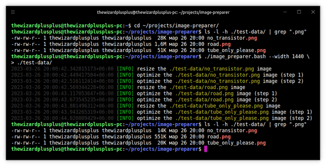

# Image Preparer



The utility for image preparation.

## Features

- search of images:
  - recursive search (optionally);
  - filtering by a pattern of image filenames (uses a name pattern of the `find` tool);
- resizing of images larger than the specified size with the [Lanczos](https://en.wikipedia.org/wiki/Lanczos_resampling) filter (optionally);
- optimization of images (optionally):
  - via the [pngquant](https://pngquant.org/) tool;
  - via the [OptiPNG](http://optipng.sourceforge.net/) tool;
  - via the `advpng` tool from the [AdvanceCOMP](http://www.advancemame.it/) project;
- logging of image changes:
  - logging of a change of an image resolution on resizing;
  - logging of a change of an image size:
    - on the following operations:
      - resizing;
      - optimization;
    - logging of a total change of image sizes:
      - total change after all the optimization steps;
      - total change after both resizing and optimization operations;
      - total change for all images together;
    - logging of a saved image size in percent.

## Requirements

- [ImageMagick](http://www.imagemagick.org/) >=6.7.7-10, <7.0;
- [pngquant](https://pngquant.org/) >=2.9.1, <3.0;
- [OptiPNG](http://optipng.sourceforge.net/) >=0.7.6, <1.0;
- [AdvanceCOMP](http://www.advancemame.it/) >=2.1.0, <3.0.

## Usage

```
$ image_preparer.bash -v | --version
$ image_preparer.bash -h | --help
$ image_preparer.bash [options] [<path>]
```

Options:

- `-v`, `--version` &mdash; show the version;
- `-h`, `--help` &mdash; show the help;
- `-n PATTERN`, `--name PATTERN` &mdash; a pattern of image filenames (uses a name pattern of the `find` tool; default: `*.png`);
- `-r`, `--recursive` &mdash; recursive search of images;
- `-w WIDTH`, `--width WIDTH` &mdash; a maximum width of images (default: `640`);
- `--no-resize` &mdash; don't resize images;
- `--no-optimize` &mdash; don't optimize images.

Arguments:

- `<path>` &mdash; base path to images (default: `.`).

## License

The MIT License (MIT)

Copyright &copy; 2018, 2023 thewizardplusplus
